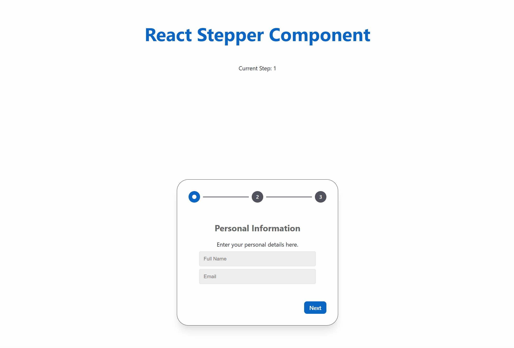

# React Stepper Component

A highly customizable, animated React stepper component built with TypeScript and Framer Motion. Perfect for multi-step forms, onboarding flows, and guided user experiences.



## Features

- 🎨 **Highly Customizable** - Custom step indicators, buttons, and styling
- ⚡ **Smooth Animations** - Powered by Framer Motion for fluid transitions
- 📱 **Responsive Design** - Works seamlessly across all device sizes
- 🔧 **TypeScript Support** - Full type safety and IntelliSense
- 🎯 **Easy to Use** - Simple API with sensible defaults
- 🚀 **Performance Optimized** - Efficient rendering and animations

## Installation

Clone the repository and install dependencies:

```bash
git clone <repo-url>
cd react-stepper
npm install
```

## Dependencies

This component requires the following dependencies:

```json
{
  "react": "^19.1.0",
  "react-dom": "^19.1.0",
  "framer-motion": "^12.23.6"
}
```

## Quick Start

```tsx
import Stepper from "~components/Stepper/Stepper";
import { Step } from "~components/Stepper/Step/Step";

function App() {
  const [currentStep, setCurrentStep] = useState(1);

  return (
    <Stepper 
      step={1} 
      onStepChange={(step) => setCurrentStep(step)}
      onCompletion={() => console.log("Completed!")}
    >
      <Step>
        <h2>Step 1</h2>
        <p>Your first step content</p>
      </Step>
      
      <Step>
        <h2>Step 2</h2>
        <p>Your second step content</p>
      </Step>
      
      <Step>
        <h2>Step 3</h2>
        <p>Your final step content</p>
      </Step>
    </Stepper>
  );
}
```

## Development

Start the development server:

```bash
npm start
```

Build for production:

```bash
npm run build
```

## API Reference

### Stepper Props

| Prop | Type | Default | Description |
|------|------|---------|-------------|
| `step` | `number` | `1` | Initial step number |
| `children` | `ReactNode` | - | Step components to render |
| `onStepChange` | `(step: number) => void` | `() => {}` | Callback when step changes |
| `onCompletion` | `() => void` | `() => {}` | Callback when stepper completes |
| `nextButton` | `ButtonProps` | `{ text: "Next" }` | Next button configuration |
| `previousButton` | `ButtonProps` | `{ text: "Back" }` | Previous button configuration |
| `stepIndicator` | `(props: StepIndicatorProps) => ReactNode` | - | Custom step indicator renderer |
| `disabledStepIndicator` | `boolean` | `false` | Disable step indicator clicks |

### ButtonProps

| Prop | Type | Description |
|------|------|-------------|
| `text` | `string` | Button text |
| `disabled` | `boolean` | Disable button |
| `onChange` | `ButtonHTMLAttributes<HTMLButtonElement>` | Additional button props |

### Step Component

The `Step` component is a simple wrapper for step content:

```tsx
<Step>
  {/* Your step content */}
</Step>
```

## Customization Examples

### Custom Button Styling

```tsx
<Stepper
  nextButton={{
    text: "Continue",
    onChange: { className: "custom-next-btn" }
  }}
  previousButton={{
    text: "Go Back",
    onChange: { className: "custom-prev-btn" }
  }}
>
  {/* Steps */}
</Stepper>
```

### Custom Step Indicators

```tsx
<Stepper
  stepIndicator={({ step, currentStep, onClick }) => (
    <div 
      className={`custom-indicator ${step === currentStep ? 'active' : ''}`}
      onClick={() => onClick(step)}
    >
      {step}
    </div>
  )}
>
  {/* Steps */}
</Stepper>
```

### Disabled Step Navigation

```tsx
<Stepper disabledStepIndicator={true}>
  {/* Users can only navigate using Next/Back buttons */}
</Stepper>
```

## Styling

The component comes with default CSS classes that you can override:

- `.stepper-container` - Main container
- `.transition-container` - Transition wrapper
- `.step-indicator-container` - Step indicators wrapper
- `.footer-container` - Button footer
- `.next_button-container` - Next button
- `.previous-button-container` - Previous button

## Advanced Usage

### Controlled Step Management

```tsx
function AdvancedStepper() {
  const [currentStep, setCurrentStep] = useState(1);
  const [formData, setFormData] = useState({});

  const handleStepChange = (step: number) => {
    // Validate current step before proceeding
    if (validateStep(currentStep)) {
      setCurrentStep(step);
    }
  };

  return (
    <Stepper
      step={currentStep}
      onStepChange={handleStepChange}
      onCompletion={() => submitForm(formData)}
    >
      {/* Steps with form validation */}
    </Stepper>
  );
}
```

### Integration with Form Libraries

```tsx
// Works great with react-hook-form, formik, etc.
<Stepper onStepChange={(step) => trigger()}>
  <Step>
    <input {...register("email", { required: true })} />
  </Step>
</Stepper>
```

## Browser Support

- Chrome (latest)
- Firefox (latest)
- Safari (latest)
- Edge (latest)

## Contributing

1. Fork the repository
2. Create your feature branch (`git checkout -b feature/amazing-feature`)
3. Commit your changes (`git commit -m 'Add amazing feature'`)
4. Push to the branch (`git push origin feature/amazing-feature`)
5. Open a Pull Request

## License

This project is open source and available under the [MIT License](LICENSE).

## Built With

- [React](https://reactjs.org/) - UI Library
- [TypeScript](https://www.typescriptlang.org/) - Type Safety
- [Framer Motion](https://www.framer.com/motion/) - Animations
- [Vite](https://vitejs.dev/) - Build Tool